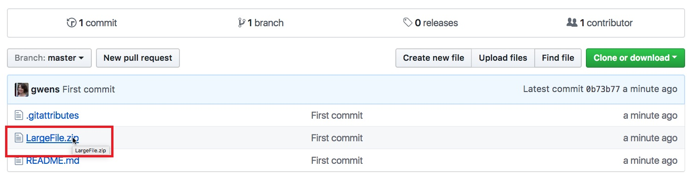
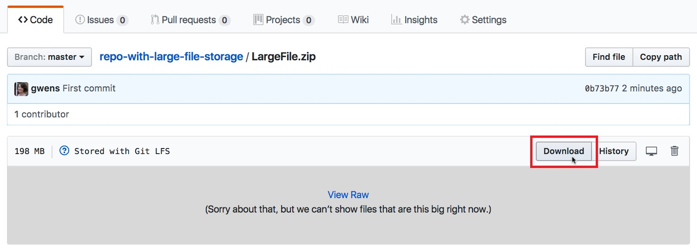

# Apress Source Code

This repository accompanies [*Pro .NET Memory Management*](https://www.apress.com/9781484240267) by Konrad Kokosa (Apress, 2018).

[comment]: #cover

## Instructions

This repository contains files that are stored with Git Large File Storage (LFS). To download the complete package, including any large files, first install [Git LFS](https://git-lfs.github.com/). Then clone the repository to your machine using Git or GitHub Desktop.

If you are unable to install Git LFS or prefer not to, you can obtain the complete package by following these steps:

1. Download the package as a zip using the green button, or clone the repository to your machine using Git or GitHub Desktop. This package will contain placeholder files for each of the files stored with Git LFS.
2. For each file stored with Git LFS:
    1. Navigate to the file on GitHub in your browser.

    

    2. Select **Download** to download the file from Git Large File Storage.

    
